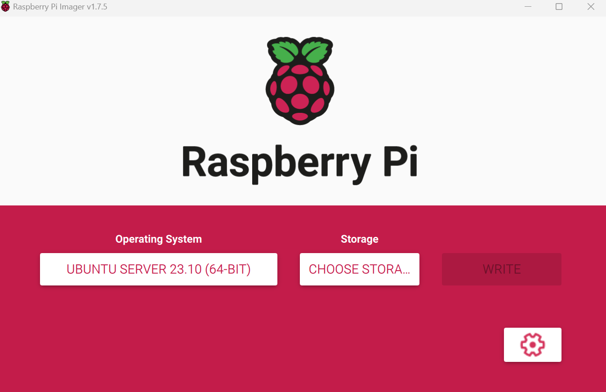
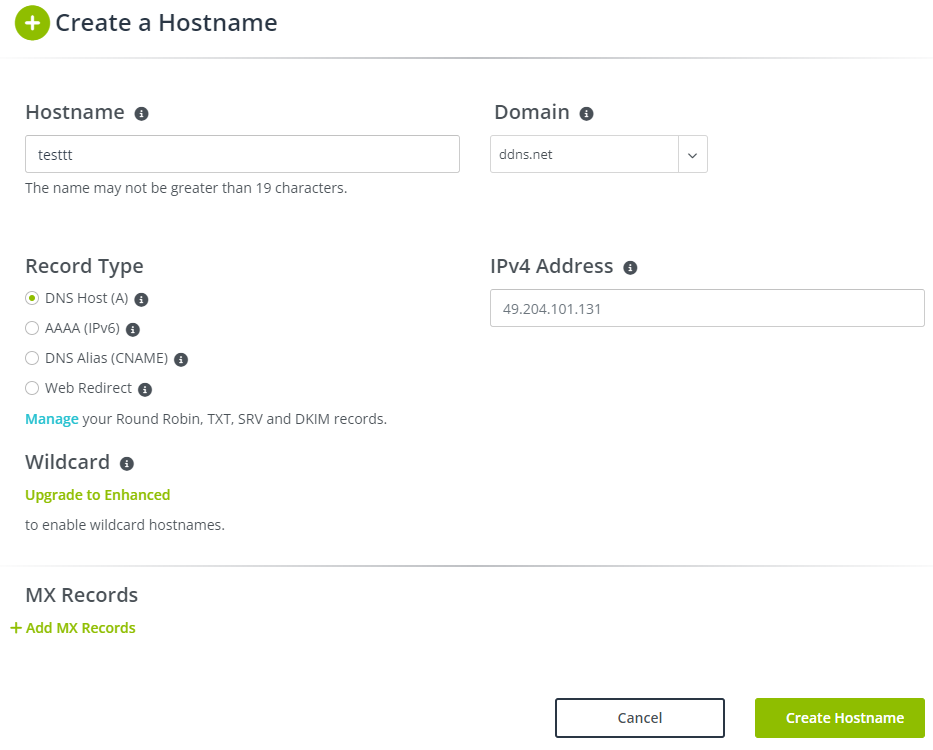

# Linux Fundamentals

## Overview
- There are multiple flavours of Linux. We will start learning Ubuntu.
- We will be using [RaspberryPI 5](https://www.raspberrypi.com/products/raspberry-pi-5/) explore this tutorial.


## Modules
- Installation
- Package Manager
- System Init
- User & Roles
- File System
- Networking
- Processes
- Monitoring
- Shell Scripting

### Installation
- Download Raspberry Pi Imager from [here](https://www.raspberrypi.com/software/)
- Load SD card and flash 64bit Ubuntu Server as below
  - Operating System navigate: Other general-purpose OS -> Ubuntu -> Ubuntu Server 23.10 (64-BIT)
  - Storage: Select Fash Drive
  - Setting: Configure below
    - hostname: `As per your desire`
    - Enable ssh: `Use password authentication`
    - Set username and password: `As per your desire`
    - Configure wireless LAN: `As per your WIFI`
    - Set locale setting: `Set timezone & Kayboard Layout`
    
- Static IP Address from Raspberry pi. 
  - This will change continuosly.
  - To avoid this, login to wifi router -> Network -> DHCP Server -> Address Reservation
  - Identify MAC ID of raspberry pi and start allocating an address range.
  - Reboot pi.
- Enable network
  ```bash
  sudo apt update
  sudo apt install net-tools
  hostname
  ```
- Access Raspberry pi from Internet.
  - Login to [no-ip](https://www.noip.com/)
  - Goto Dynaic DNS -> Create Hostname
  - Goto Wifi Router -> Dynamic DNS -> Register No-IP `UserName, Password, Domain` -> Enable WAN IP Binding. This step will help to automtically update Router public IP with No-IP Hostname.
  - Goto Wifi Router -> Nat Forwarding -> DMZ -> Pi IP Address & Enable
  
- Testing
  - Windows Powershell Command -> Test-NetConnection `no-ip domain` -p 22

### System Init
- `SystemD` is a system and service manager for Linux operating systems.
- It serves as an init system, which means it is responsible for initializing the user space and managing system services during the boot process.
- 

### Commands
- Check Temperature
  ```bash
  vcgencmd measure_temp
  ```
- Check Voltage - Good if code is `0x0`
  ```bash
  vcgencmd get_throttled
  ```