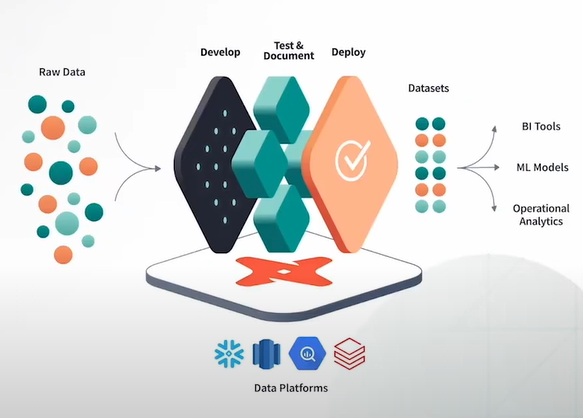
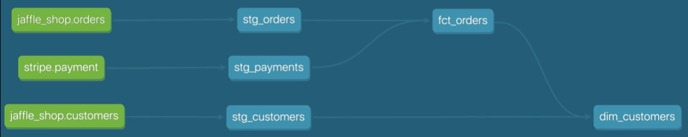

# Data Build Tool - DBT 

## Overview
- It is becomming a standard SQL tempalting process for Data Transformation in [ETL/ELT - Extract, Load, Transform] data pipelines.
  - `ETL:`
    - Used to extract data from different OLTP environment.
    - Transform the data to based on the destination format provided in OLAP environment.
    - Load the data into OLAP/Data Warehouse.
    - This centralized data was later used for Analytics, AI/ML or Down Stream Processing. 
    - Used by on-premise dataware house tools like infomatica etc...
    
  - `ELT:`
    - Data from different OLTP environment is directly loaded into OLAP environment.
    - Transformation is then perfomed using elastic compute.
    - Used by cloud providers like Snowflake, Databricks etc...
    
- It is an open-source command line tool that helps analysts and engineers transform data in their warehouse more effectively.
- It enables analytics engineers to transform data in their warehouses by writing select statements, and turns these select statements into tables and views.
- dbt code is a combination of `SQL` and `Jinja` - a common templating language.
- At the most basic level, dbt has two components: 
  - `Compiler`: Converts code into Raw SQL
  - `Runner`: Executes inside a datawarehouse
- It works on below principles
  
  

## History
- It was founded by Fishtown Analytics (later named as dbt Labs) in 2016.
- In 2018, the dbt Labs team released a commercial product on top of dbt Core.
- In Feb 2022 they received $222 million with a valuation of $4.2 Billion.

## DBT Core
- It is an open-source command line tool that can be installed locally in your environment, and communicate with databases using adapters.
- DBT Core building blocks
  - Project creation steps:
    ```bash
    python3 -m venv  
    ```
  - `dbt_project.yml` is the starting point to identify profile, models, test etc...
  - `profiles.yml` contains the connection details for your data platform

## Modules
- `Naming Convention:`
  - `Sources (src):` Refer to the raw table data that have been built in the warehouse through a loading process. (We will cover configuring Sources in the Sources module)
  - `Staging (stg):` refers to models that are built directly on top of sources. These have a one-to-one relationship with sources tables. These are used for very light transformations that shape the data into what you want it to be. These models are used to clean and standardize the data before transforming data downstream. Note: These are typically materialized as views.
  - `Intermediate (int):` refers to any models that exist between final fact and dimension tables. These should be built on staging models rather than directly on sources to leverage the data cleaning that was done in staging.
  - `Fact (fct):` refers to any data that represents something that occurred or is occurring. Examples include sessions, transactions, orders, stories, votes. These are typically skinny, long tables.
  - `Dimension (dim):` refers to data that represents a person, place or thing. Examples include customers, products, candidates, buildings, employees.
  
- `Model:`
  - These are SQL statements with extenssion `.sql`.
  - Each represent one modular peice of logic that will take raw data and build final transform data.
  - Mostly each has on-to-one relationship with table or view in data warehouse. 
  - dbt will create DDL/DML automatically.
  - `Config` block can be used to decalre result DDL is table or view. By default views are created.
    ```
    {{ config(
        materialized='table'
    ) }}
    ```
  - These are available in `models` folder.
  - `ref` functions are used to reference one model in another `{{ ref('stg_customers')}}`. These will be converted to actual tables during compilation.
- `Source:`
  - `source` functions are used to reference source tables.
    ```sql
    select 
      id as customer_id,
      first_name,
      last_name
    from {{ source('jaffle_shop', 'customers') }}
    ```
  - `.yml` can be used define source database, table name etc...
    ```yaml
    version: 2
    sources:
      - name: jaffle_shop
        database: raw
        schema: jaffle_shop
        tables:
          - name: customers
          - name: orders
            loaded_at_field: _etl_loaded_at
            freshness:
              warn_after: {count: 12, period: hour}
              error_after: {count: 24, period: hour}
    ```
- `Test:`
  - Assertions to check if the data migration is getting done as planned. 
  - Tests are executed as SQL code.
  - Types
    - `Singular:` 
    - `Generic:` 
      - Checks for below
        - Unique
        - Not Null
        - Accepted Values
        - Relationships
- `Commands:` [Available here](https://docs.getdbt.com/reference/commands/build)
  
## Tutorial
- [Official Site](https://www.getdbt.com/)
- [Offical Documentation](https://docs.getdbt.com/)
- [Offical Courses](https://courses.getdbt.com/collections/courses)
- [Youtube - Playlist](https://www.youtube.com/playlist?list=PLohMhitTY9xuEVMpLG3xXhsKG9j2XCTeF)
- [Youtube - Crash Course For Beginners](https://www.youtube.com/watch?v=toSAAgLUHuk)
- [Youtube - DBT crash course for beginners: Zero to Hero](https://www.youtube.com/watch?v=C6BNAfaeqXY)
- [Tutorialspoint](https://www.tutorialspoint.com/learn-dbt-data-build-tool/index.asp)

## Reference
- [DBT with DuckDB](https://blog.det.life/transforming-data-engineering-a-deep-dive-into-dbt-with-duckdb-ddd3a0c1e0c2), [Github here](https://github.com/fvgm-spec/learn_dbt/tree/main)
- [DBT & DuckDB](https://medium.com/datamindedbe/use-dbt-and-duckdb-instead-of-spark-in-data-pipelines-9063a31ea2b5)
- [DBT bigger than Spark](https://medium.com/datamindedbe/why-dbt-will-one-day-be-bigger-than-spark-2225cadbdad0)