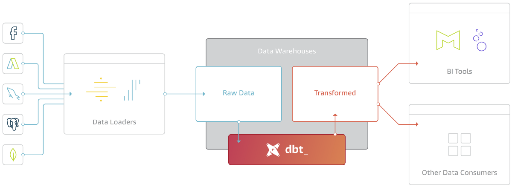

# Data Build Tool - DBT 

## Overview
- It is becomming a standard SQL tempalting process for Data Transformation in [ETL/ELT - Extract, Load, Transform] data pipelines.
  - `ETL:`
    - Used to extract data from different OLTP environment.
    - Transform the data to based on the destination format provided in OLAP environment.
    - Load the data into OLAP/Data Warehouse.
    - This centralized data was later used for Analytics, AI/ML or Down Stream Processing. 
    - Used by on-premise dataware house tools like infomatica etc...
    
  - `ELT:`
    - Data from different OLTP environment is directly loaded into OLAP environment.
    - Transformation is then perfomed using elastic compute.
    - Used by cloud providers like Snowflake, Databricks etc...
    
- It is an open-source command line tool that helps analysts and engineers transform data in their warehouse more effectively.
- It enables analytics engineers to transform data in their warehouses by writing select statements, and turns these select statements into tables and views.
- dbt code is a combination of `SQL` and `Jinja` - a common templating language.
- At the most basic level, dbt has two components: 
  - `Compiler`: Converts code into Raw SQL
  - `Runner`: Executes inside a datawarehouse
- It works on below principles
  

## History
- It was founded by Fishtown Analytics (later named as dbt Labs) in 2016.
- In 2018, the dbt Labs team released a commercial product on top of dbt Core.
- In Feb 2022 they received $222 million with a valuation of $4.2 Billion.

## Modules

## Tutorial
- [Offical Documentation](https://docs.getdbt.com/)
- [Offical Courses](https://courses.getdbt.com/collections/courses)
- [Youtube - Playlist](https://www.youtube.com/playlist?list=PLohMhitTY9xuEVMpLG3xXhsKG9j2XCTeF)

## Refernce
- [Official Site](https://www.getdbt.com/)