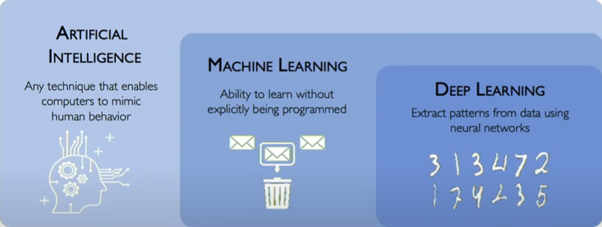

# Deep Learning

## Overview
- `Artificial Intelligence (AI)` is a broad discipline with roots in the 1950s, focused on creating machines capable of mimicking human intelligence. 
- `Machine Learning`, a subset of AI, was developed in the 1980s. Its primary focus is on enabling machines to learn from data, improve their performance, and make decisions without explicit programming.
- `Deep Learning`, a subset of ML that uses artificial neural networks (ANNs) to mimic the human brain's learning process and automate complex tasks. 
  - These ANNs have more than 3 layers.
  - Input data is also not labeled and system will try to identify patterns.
    
    

## Neural Networks
- 

## References
- [Linear Algebra](https://www.youtube.com/watch?v=fNk_zzaMoSs&list=PLZHQObOWTQDPD3MizzM2xVFitgF8hE_ab)
- [Calculus](https://www.youtube.com/watch?v=WUvTyaaNkzM&list=PLZHQObOWTQDMsr9K-rj53DwVRMYO3t5Yr)
- [Probability & Statistics](https://www.youtube.com/watch?v=COI0BUmNHT8&list=PLyqSpQzTE6M_JcleDbrVyPnE0PixKs2JE)
- [NPTEL - Essential Mathematics for Machine Learning](https://www.youtube.com/watch?v=JO9jNe6BemE&list=PLLy_2iUCG87D1CXFxE-SxCFZUiJzQ3IvE)
- [Stanford - Python](https://www.youtube.com/watch?v=Oe6rHPmFY3o&list=PLVxFQjPUB2cnYGZPAGG52OQc9SpWVKjjB)
- [Neural Networks Demystified](https://www.youtube.com/watch?v=bxe2T-V8XRs&list=PLiaHhY2iBX9hdHaRr6b7XevZtgZRa1PoU)
- [PyTorch for Deep Learning & Machine Learning](https://www.youtube.com/watch?v=V_xro1bcAuA)
- [3Blue1Brown Deep Learning](https://www.youtube.com/watch?v=aircAruvnKk&list=PLZHQObOWTQDNU6R1_67000Dx_ZCJB-3pi)
- [Standford Machine Learning](https://www.youtube.com/watch?v=Bl4Feh_Mjvo&list=PLoROMvodv4rNyWOpJg_Yh4NSqI4Z4vOYy)
- [Standford Deep Learning](https://www.youtube.com/watch?v=rmVRLeJRkl4&list=PLoROMvodv4rMFqRtEuo6SGjY4XbRIVRd4)
- [MI Deeplearning](http://introtodeeplearning.com/), [Playlist](https://www.youtube.com/watch?v=ErnWZxJovaM&list=PLtBw6njQRU-rwp5__7C0oIVt26ZgjG9NI&index=2)
- [NPTEL - Deeplearning](https://www.youtube.com/watch?v=aPfkYu_qiF4&list=PLEAYkSg4uSQ1r-2XrJ_GBzzS6I-f8yfRU)
- [Andrej Karpathy - Neural Networks: Zero to Hero](https://www.youtube.com/playlist?list=PLAqhIrjkxbuWI23v9cThsA9GvCAUhRvKZ)
- [Microsoft - Generative-ai-for-beginners](https://github.com/microsoft/generative-ai-for-beginners?tab=readme-ov-file)