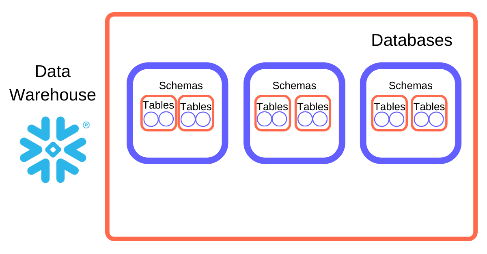

# DuckDB

## Overview
- It is a single node Online analytical processing (OLAP) database. 

## History
## Modules
-

## Tutorial
- [Configure Snowflake for dbt Cloud](https://www.youtube.com/watch?v=kbCkwhySV_I) 
  
  ```sql
  -- Login to snowflake and switch role as ACCOUNTADMIN
  -- Create a new worksheet
  
  -- Create new warehouse, databse and role
  create warehouse transforming;
  create database analytics;
  create role transformer;

  -- Grant roles on snowflake_sample_data
  grant IMPORTED PRIVILEGES on database snowflake_sample_data to role transformer;
  grant usage on schema snowflake_sample_data.tpch_sf10 to role transformer;
  grant select on all tables in schema snowflake_sample_data.tpch_sf10 to role transformer;

  -- Grant database role
  grant usage on database analytics to role transformer;
  grant reference_usage on database analytics to role transformer;
  grant modify on database analytics to role transformer;
  grant monitor on database analytics to role transformer;
  grant create schema on database analytics to role transformer;

  -- Grant wharehouse role
  grant operator on warehouse transforming to role transformer;
  grant usage on warehouse transforming to role transformer;

  -- Add role to user
  grant role transformer to user RAHGADDA;

  -- Login to snowflake and switch role as transformer
  -- Select warehouse as transforming
  -- Testing
  create or replace schema dbt_available;
  create table analytics.dbt_available.customers as 
  (select * from snowflake_sample_data.tpch_sf10.customers);
  drop schema analytics.dbt_available;
  ```

## Refernce