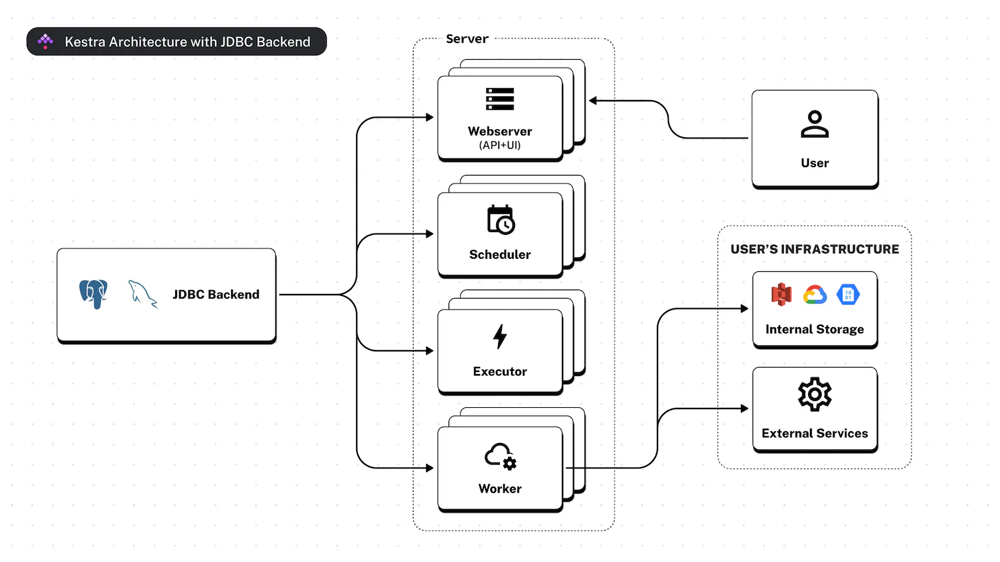
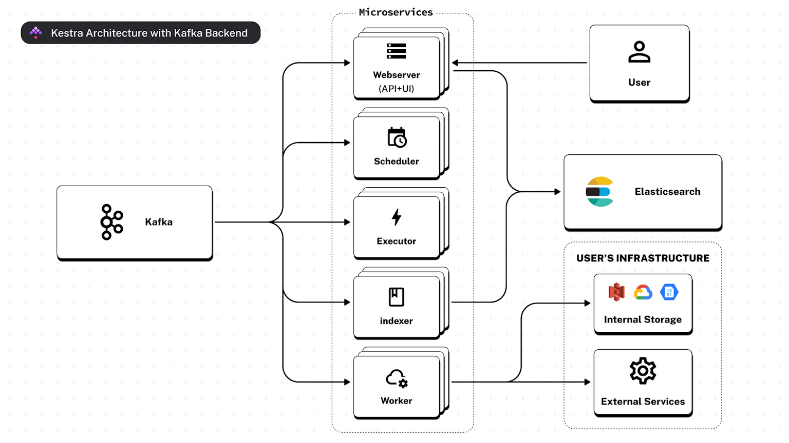

# Kestra.io

## Overview
- Companies build data pipelines to prepare data ingredients, extract insights, and distribute findings across internal and external parties.
- Kestra is a universal open-source orchestrator that makes both scheduled and event-driven workflows easy.
- Building blocks
  - `Namespace:`
    - Used for logical grouping of flows.
    - the dot `.` symbol can add hierarchical structure to  namespaces.
  - `Flows:`
    - Defined declartively to keep the orchestration code portable and language-agnostic.
    - It is a container for tasks and and their orchestration logic, as well as labels, variables, inputs, outputs and triggers.
    - Defined in yaml.
    - It has three parts
      - **Mandatory:**
        - `id:` Name of the flow. Should be unique within a namespace.
        - `namespace:` Used to isolate environments like dev, prod.
        - `tasks:` 
          - Atomic actions in flow.
          - Stateless by default.
          - Tasks that will be executed in the order they are defined.
          - Tasks are defined in the form of a list.
          - By default, all tasks in the list will be executed sequentially
          - Tasks can also be customized to execute in parallel. These are called `Flowable` tasks.
          - Task also have parameters. Each task will have additional parameters depend on task type
            - `id:` Unique identification of the task in task list.
            - `type:`
              - `Core:` 
                - Available in `io.kestra.core.tasks.flows`.
                - Used to declare which processes should run in parallel or sequentially or conditional branching, iterating over a list of items, pausing or allowing certain tasks to fail without failing the execution.
              - `Scripts:`
                - Used to run scripts in Docker containers or local processes.
                - These include Python, Node.js, R, Julia, Shell or PowerShell.
              - `Internal Storage:`
                - Available in `io.kestra.core.tasks.storages`.
                - These along with output are used to interact with internal storage.
                - Kestra uses internal storage to pass data between tasks. It is mainly used to pass data within a single flow execution.
              - `State Store:`
                - If you need to pass data between different flow executions, you can use the State Store.
                - The tasks Set, Get and Delete from the io.kestra.core.tasks.states category allow you to persist files between executions (even across namespaces).
      - **Optional:**
        - `labels:` Another layer of organization, allowing you to group flows using key-value pairs.
        - `description:` Enhace flow documentation. Supports markdown syntax.
  - `Inputs:`
    - Used to declare variabels instead of hardcoding.
    - Inputs can be accessed in any task using expression `{{ inputs.input_name }}`.
    - It contains below
      - **Mandatory:**
        - `name:` Variable name.
        - `type:` Data type of varaiables. Supports STRING - not parsed, they are passed as-is, INT - No decimal points, BOOLEAN - true or false, FLOAT, DATETIME, DATE, DURATION, JSON, URI & FILE. 
      - **Optional**
        - `defaults:` Default value of input varaible to be considered if not provided.
        ```yaml
        id: inputs_demo
        namespace: dev

        inputs:
        - name: user
          type: STRING
          defaults: Rick Astley
        - name: api_url
          type: STRING
          defaults: https://dummyjson.com/products

        tasks:
        - id: api
          type: io.kestra.plugin.fs.http.Request
          uri: "{{ inputs.api_url }}"
        - id: hello
          type: io.kestra.core.tasks.log.Log
          message: Hey there, {{ inputs.user }}
        ```
  - `Outputs:`
    - Tasks and flows can generate outputs, which can be passed to downstream processes. 
    - These outputs can be variables or files stored in the internal storage.
    - Outputs can be accessed using syntax `{{ outputs.task_id.output_property }}` or `{{ outputs['task-id'].output_property }}`
  - `Triggers:`
    - Used to automatically start flows based on events.
    - A trigger can be a scheduled date, a new file arrival, a new message in a queue, or the end of another flow's execution.
    - The trigger definition looks similar to the task definition — it contains an id, a type, and additional properties related to the specific trigger type.
    - Kestra core provides three types of triggers. Component specific triggers are also available like new file created in S3.
      - `Schedule:` Execute flow on a regular cadence e.g. using a CRON expression.
      - `Flow:` Execute flow when another flow finishes its execution (based on a configurable list of states)
      - `Webhook:` Execute low based on an HTTP request emitted by a webhook.
  - `Flowable:`
    - These tasks control the orchestration logic — run tasks or subflows in parallel, create loops and conditional branching.
  - `Errors:`
    - Kestra provides automatic retries and error handling to help you build resilient workflows.
    - Failure of any task will stop the execution and will mark it as failed.
    - The `errors` property allows you to execute one or more actions before terminating the flow. 
    - Errors handling can be implemented at flow or namespace level.
  - `Retries:`
    - Each task can be retried a certain number of times and in a specific way.
    - `retry` property details retry stratery. 
    - There are different types of retries
      - `Constant:`
        - The task will be retried every X seconds/minutes/hours/days.
      - `Exponential:`
        - The task will also be retried every X seconds/minutes/hours/day but with exponential time interval in between each retry attempt.
      - `Random:`
        - The task will be retried every X seconds/minutes/hours/days with a random delay.
  - `Execution:`
    - It is a single run of a flow in a specific state.
    - Each task run can be in a particular state like CREATED, RUNNING, PAUSED, SUCCESS, WARNING, FAILED, KILLING, KILLED & RESTARTED
  - `Variables:`
    - Variables are key-value pairs that help reuse some values across tasks.
    - Variables can also be stored on a namespace level so that they can be reused across multiple flows in a given namespace.
    - Syntax for using variables is {{ vars.variable_name }}.
    - These can be used in task properties documented as dynamic.
  - `Task Defaults:`
    - It is a list of default values applied to each task of a certain type within a flow(s).
    - It helps to avoid repeating task properties on multiple occurrences of the same task.
    - These are resolved at runtime and the editor is not aware of those default attributes until you run your flow.
  - `Sub FLow:`
    - It supports to build modular and reusable workflow components that can be called from a different flow.
    - Task of type `io.kestra.core.tasks.flows.Subflow` should be created in caller flow and pass the specify `flowId` and `namespace` of the subflow that you want to execute.
- Predefined Variables
  - `{{ outputFiles }}` property allows to specify a list of files to be persisted in Kestra's internal storage. 
  - Files stored in `{{ outputDir }}` property will be persisted in Kestra's internal storage.
  - Kestra will launch each task within a temporary working directory on a Worker. The `{{ workingDir }}` property  allows reusing the same file system's working directory across multiple tasks.

## History
- Kestra started in 2019 with this initial commit. At this time, Kestra was at the proof-of-concept stage.
- `Adeo` is the leading French company in the international DIY and home improvement market.
- `Leroy Merlin` is the leading brand of the Adeo Group and helps residents around the world with all their home improvement projects - from renovations and extensions, to decoration and repairs.
- In 2019, Leroy Merlin and Adeo decided to move from an on-premise server to a cloud-based system. They needed a solution that could not only handle all the previous use cases, but improve upon them, and find a new way to work, all with an ambitious objective: being a fully cloud-based operation by 2022.
- Leroy Merlin team started with `Google Composer`,`Apache Airflow` but found out they lacked features. 
- Team realised limitation of available platforms and started building an opensource data migration pipeline `kestra.io` with Apache 2.0 licencing. More details are available [here](https://kestra.io/blogs/2022-02-01-kestra-opensource), [here](https://kestra.io/blogs/2022-02-22-leroy-merlin-usage-kestra)
- Lead visioner is `Ludovic Dehon` and profile is available [here](https://www.linkedin.com/in/ludovic-dehon/?originalSubdomain=fr)

## Architecture
- Kestra's architecture is designed to be scalable, flexible and fault-tolerant.
- It supports two architectures depending on backend used
  - **JDBC:**
    - `Building blocks:`
      - `JDBC Backend:` Data storage layer used for orchestration metadata.
      - `Server:`
        - `Webserver:` Servers UI/API
        - `Scheduler:` Schedules workflows and handles all triggers except for the flow triggers.
        - `Executor:` Responsible for the orchestration logic including flow triggers.
        - `Worker:` One or multiple processes that carry out the heavy computation of runnable tasks and polling triggers.
    - Support multiple instances of the Webserver, Executor, Worker and Schedulor to handle increased load.
    - JDBC Backend can be scaled using clustering or sharding.
    - As workload increases, more instances of the required components can be added to the system to distribute the load and maintain performance.
    - Scheduler is the only component that can only be run as a single instance, but this will change in the near future.

    
  - **Kafka:**
    - Available only for Enterprise Edition.
    - Can run multiple (horizontally scaled) instances of services such as Workers, Schedulers, Webservers and Executors to distribute load and maintain system performance as demand increases
    
    

## Installation
- Below are steps to load parquet data transform using DBT and persist into Snowflake
  ```bash
  
  # Installation
  cd 01-ML/03-projects/Kestra-io
  curl -o docker-compose.yml https://raw.githubusercontent.com/kestra-io/kestra/develop/docker-compose.yml
  docker compose up
  
  # Deployment URL: 
  # http://localhost:8080/ui/welcome
  
  # Creating duckdb with parquet files, transform with dbt and persist to snowflake
  # Navigate to Flows -> Create -> 03-projects/demo.yaml -> Execute 
  ```

## Modules

## Tutorial
- [Docs](https://kestra.io/docs)
- [Plugins](https://kestra.io/plugins)
- [Demo](https://us.kestra.cloud/ui/login?from=/ui/demo/dashboard)
- [Data Ingestion, Transformation and Orchestration](https://dev.to/kestra/end-to-end-data-ingestion-transformation-and-orchestration-with-airbyte-dbt-and-kestra-1lmo)
- [Intro to Kestra](https://medium.com/geekculture/intro-to-kestra-open-source-orchestration-and-scheduling-platform-a712f5238491)
- [Restack - Kestra introduction](https://www.restack.io/docs/kestra-knowledge-kestra-tutorial-guide)
- [Data lakehouse - Dremio, dbt and Python](https://kestra.io/blogs/2023-12-07-dremio-kestra-integration)

## Reference
- [Linkedin - Kestra.io](https://www.linkedin.com/company/kestra/)
- [Airbyte - Connector based data replicator](https://airbyte.com/)
- [Free kestra on Restack](https://www.restack.io/store/kestra)