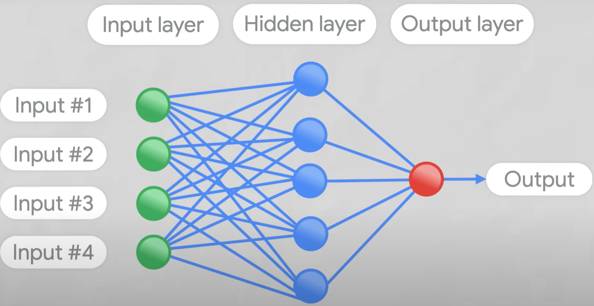

# Large Language Model

## Overview
- `Artificial Intelligence (AI)` is a broad discipline with roots in the 1950s, focused on creating machines capable of mimicking human intelligence. 
- `Machine Learning`, a subset of AI, was developed in the 1980s. Its primary focus is on enabling machines to learn from data, improve their performance, and make decisions without explicit programming. 
- `Generative AI (GAI)`, evolved from ML in the early 21st century, represents a class of algorithms capable of generating new data. They construct data that resembles the input, making them essential in fields like content creation and data augmentation.
- An important subset of GAI is the `Generative Adversarial Network (GAN)`, introduced by Ian Goodfellow in 2014. GANs consist of two neural networks: a generator that produces synthetic data and a discriminator that distinguishes this data from real instances.
- `Large Language Models (LLM)` also arose from the GAI subset. LLMs generate human-like text by predicting the likelihood of a word given the previous words used in the text.
- `GPT, or Generative Pretrained Transformer`, is a specific type of LLM developed by OpenAI.  GPT models are trained on vast amounts of text data and can generate coherent, contextually relevant sentences.
- `Transformers:`
  - Transformer models are used to solve all kinds of `NLP tasks`.
  - The most basic object in the Transformers library is the `pipeline()` function. It connects a model with its necessary preprocessing and postprocessing steps, allowing us to directly input any text and get an intelligible answer
    
  - Braodly trasformers are catergorized into below
    - GPT-like (also called `auto-regressive` Transformer models)
    - BERT-like (also called `auto-encoding` Transformer models)
    - BART/T5-like (also called `sequence-to-sequence` Transformer models)
  - A `neural network` is a series of algorithms that endeavors to recognize underlying relationships in a set of data through a process that mimics the way the human brain operates.
    
  - There are different types of neural networks for different types of task CNN,RNN,FNN,MNN.
  - `Encoder` takes inputs and creates vector representation as output.
  - `Decoder` takes vector representation and creates output similar to Encoder Input.
  - The combination of Encoder & Decoder can be used to auto train neural network and get desired weights for generating expected output.

## Abbreviations
| Terminology         	       | Description                                                                                                                                                                                                                                                                                                                                                                                                                                                           	|
|---------------------	       |-----------------------------------------------------------------------------------------------------------------------------------------------------------------------------------------------------------------------------------------------------------------------------------------------------------------------------------------------------------------------------------------------------------------------------------------------------------------------	|
| Token               	       | A unit of text that LLMs read, process, and generate, typically representing a word or a sub-word.                                                                                                                                                                                                                                                                                                                                                                     |
| Prompt              	       | The input text or query provided to an LLM to generate a coherent and relevant response.                                                                                                                                                                                                                                                                                                                                                                              	|
| Temperature         	       | It is a hyperparameter that affects the randomness and diversity of the generated text.                                                                                                                                                                                                                                                                                                                                                                               	|
| Weights             	       | It refer to the parameters or numerical values that the model learns during the training process.                                                                                                                                                                                                                                                                                                                                                                     	|
| Parameters                   | Parameters  encompass a broader set of variables that contribute to the network's behavior and performance. This includes not only weights but also other values that affect the network's operation.                                                                                                                                                                                                                                                                  |
| Inference           	       | The process of using a trained LLM to generate text in response to user inputs or queries.                                                                                                                                                                                                                                                                                                                                                                            	|
| Embedding           	       | Refers to a technique in natural language processing and machine learning where words, phrases, images, or other entities are represented as dense, continuous vectors in a lower-dimensional space.                                                                                                                                                                                                                                                                  	|
| Prompt Engineering  	       | The practice of designing effective prompts or inputs to elicit desired responses from an LLM.                                                                                                                                                                                                                                                                                                                                                                        	|
| Foundational Models 	       | Foundation models are AI models trained on huge amounts of unlabeled datasets that can be used to solve multiple downstream tasks.                                                                                                                                                                                                                                                                                                                                    	|
| Finetuned Models    	       | This is an outcome of fine-tuning foundation model for a specific task.                                                                                                                                                                                                                                                                                                                                                                                                |
| Fine-Tuning         	       | The process of customizing a pre-trained LLM on a specific task or domain using a smaller dataset to make it more accurate and relevant.                                                                                                                                                                                                                                                                                                                              	|
| Self-supervised learning     | It is a type of training in which the objective is to automatically compute from the inputs of the model. That means that humans are not needed to label the data!                                                                                                                                                                                                                                                                                                     |
| In-Context Learning 	       | LLM continues learning or adapting during its interactions with users in real-time. This can involve updating the model's behavior, preferences, or biases based on the ongoing conversation or prompts it receives from users. In-context learning enables the LLM to provide more relevant and tailored responses over time.                                                                                                                                        	|
| Transfer Learning   	       | A machine learning technique where knowledge gained from one task or domain (pre-training) is applied to another related task or domain (fine-tuning).                                                                                                                                                                                                                                                                                                                	|
| Model Quantization  	       | It is a technique to reduce the computational and memory costs of running inference by representing the weights and activations with low-precision data types like 8-bit integer (int8) instead of the usual 32-bit floating point (float32). Reducing the number of bits means the resulting model requires less memory storage, consumes less energy (in theory), and operations like matrix multiplication can be performed much faster with integer arithmetic 	|
| Multi-modal LLM     	       | An LLM that can process and generate text along with other types of media, such as images or audio.                                                                                                                                                                                                                                                                                                                                                                   	|

## References
- [Huggingface NLP Course](https://huggingface.co/learn/nlp-course/chapter1/1)
- [Fastai DeepLearning](https://course.fast.ai/)