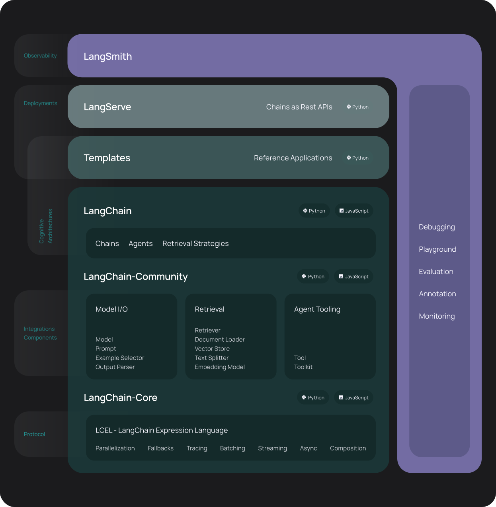

# Langchain

## Overview
- The term langchain originates from the amalgamation of `language` and `chain`, symbolizing the interlinked nature of linguistic elements within an AI framework.
- It is a framework designed to simplify the creation of applications using `Large Language Models (LLMs)`. 
- LangChain libraries are available in both Python and JavaScript.

## History
- Founder `Harrison Chase` was still an engineer at `Robust Intelligence` and ChatGPT hadn’t taken over the world yet.
- In `early 2022`, while attending a company hackathon, Harrison built a chatbot that could query internal data from Notion and Slack. That work would eventually lead to Notion QA, an open-source project where users could ask questions to internal Notion databases in natural language.
- Then, as the year wore on, he attended meetups in SF where the beginnings of an AI ecosystem were building. Stable Diffusion had ignited interest in image generation, and GPT-3 was starting to show promise for real-world applications.
- At these meetups, Harrison consistently saw common, duplicative abstractions that developers had to build on top of LLMs to make them useful and that pain point became the idea for LangChain, an open-source projects to simplify these abstractions.
- The project started on `October 16th 2022` with a fairly simple PR - [“add initial prompt stuff”](https://github.com/langchain-ai/langchain/pull/1).
- The timing was perfect, `On November 30th 2022`, ChatGPT came out and brought the first spike of developers to LangChain. In December, the month after ChatGPT’s launch, LangChain tripled in traction from 584 to 1,413 stars.
- In January 2023, Harrison made things official by recruiting [Ankush Gola](https://www.linkedin.com/in/ankush-gola-77255866/), a former coworker at Robust Intelligence, and incorporated the company.
- All in all, LangChain has won the hearts and minds of most AI developers.


## Modules
- `langchain-core`: It contains the base abstractions and runtime for the whole LangChain ecosystem. It is a core abstractions involving LangChain Runnables, tooling for observability, and base implementations of important abstractions.
  - *LCEL:*
    - It is abstracted using `LangChain Expression Language - (LCEL)`.
    - It is the foundation of many of LangChain's components, and is a declarative way to compose chains.
    - It makes it easy to build complex chains from basic components, and supports out of the box functionality such as streaming, parallelism, and logging.
    - **Features:**
      - Generate output at the same rate as the LLM provider outputs
      - Synchronous & Asynchronous API support.
      - Execute in parallel.
      - Configurable retries and fallbacks
      - Access intermediate results
      - Pydantic and JSON Schema Input and output
      - Tracing/Logging with LangSmith
      - REST API with LangServe
    - Example of basic chain - **create a prompt template, connect to openai model & generate output using output parser.**
      ```bash
      pip install -qU langchain_core langchain-openai
      ```
      ```python
      import getpass
      import os

      from langchain_openai import ChatOpenAI
      from langchain_core.prompts import ChatPromptTemplate
      from langchain_core.output_parsers import StrOutputParser

      # Getting OpenAI model password
      os.environ["OPENAI_API_KEY"] = getpass.getpass()

      # Creating instance of OpenAI GPT-4 model
      model = ChatOpenAI(model="gpt-4")

      # Creating outputparser to display user input Response
      output_parser = StrOutputParser()

      # Creating a Prompt to get better response for user input
      prompt = ChatPromptTemplate.from_template("tell me a short joke about {topic}")

      # Creating a sequential chain to connect prompt, model and output parser
      chain = prompt | model | output_parser

      # Generating response
      chain.invoke({"topic": "ice cream"})
      ```
      
      Note: Additional examples for different LLM Chat API vendors are available [here](./01-dev/langchain/01_chat_chains)
  - *Prompt:*
    - LLM applications do not pass user input directly into an LLM Models.
    - They will add the user input to a larger piece of text, called a prompt template, that provides additional context on the specific task at hand.
    - `Effective Prompting Techniques:`
      - Prompting is an art. You will likely need to try a few different approaches for your prompt if you don’t get your desired outcome the first time.
      - There are four main area's  to consider when writing an effective prompt.
        - Persona: 
        - Task:
        - Context:
        - Format:
          ```
          Your are news article writer, create a blog post to summarize banking scra regulartion, {Context}, generate response in markdown format with sections overview, validations, reference. In each of these sections use  bullet points. 
          ```
- `langchain`: Chains, agents, and retrieval strategies that make up an application's cognitive architecture.
  - *LLM:*
    - Langchain supports two methods/component types to interact with LLM's
      - `LLM:`
        - It is a general-purpose implementation of model to perform task like generating text, summarizing text, answering questions, and more.
        - The LLM objects take string as input and output string.
      - `ChatModel:`
        - It is specialized implementation of model to perform conversational tasks.
        - The ChatModel objects take a list of messages as input and output a message.
        - These are tuned specifically for having conversations.
      - Both implementations supports capabilities of Synchronous, Asynchronous invoke, streaming & batching. LLM vendors supports some or all features. 
        ```python
        import os
        from langchain.schema import HumanMessage
        from langchain_openai import ChatOpenAI
        from langchain_openai import OpenAI

        llm = OpenAI(model="gpt-3.5-turbo-0125", temperature=0)
        chat_model = ChatOpenAI(model="gpt-3.5-turbo-0125", temperature=0)

        text = "What would be a good company name for a company that makes colorful socks?"
        messages = [HumanMessage(content=text)]

        # -- LLM 
        llm.invoke(text)
        # >> Feetful of Fun

        # -- ChatModel
        chat_model.invoke(messages)
        # >> AIMessage(content="Socks O'Color")
        ```
- `langchain-community`: Third party integrations and partner packages that only rely on langchain & langchain-core.
- `langchain-<partner>`: Partner packages dedicated to especially popular integrations (e.g., langchain-openai, langchain-anthropic etc.). The dedicated packages generally benefit from better reliability and support.
- `LangGraph`: A library for building robust and stateful multi-actor applications with LLMs by modeling steps as edges and nodes in a graph.
  - Build complex, scalable AI agents using graph-based state machines.
  - Created on top of LangChain and completely interoperable with the LangChain ecosystem.
  - Using `LCEL`, it is difficult to introduce cycles into chains. Similar to acyclic graphs - `Data Orchestration Frameworks (DAG)`.
  - Inspired by `Google Pregel` and `Apache Beam`.
  - It extends `Google's Pregel graph` processing framework to provide fault tolerance and recovery when running long or error-prone workloads.
  - Cycles uses LLM reason capability of what to do next in the cycle.  
    Example:
    - Call the LLM to determine either (a) or (b)
    - Take given actions, and pass back to step 1
    - Repeat steps till a final response is generated.
  - These `controlled flows` are also referred as `state machines`.
  - Building blocks
    - `StateGraph:`
      - It represents the graph.
      - You initialize this class by passing in a `state` definition. 
      - It represents a central state object that is updated over time.
      - State is updated by `nodes` in the graph.
      - These can be updated in two ways
        - Overridden completely, useful to use nodes to return a new value of an attribute.
        - Attribute update, useful if an attribute is a list.
    - `Node:`
      - Each node represents a function or a computation step.
      - Nodes are created with `graph.add_node(name, value)`. 
        - The `name` parameter should be a string that we will use to refer to the node when adding edges.
        - The `value` parameter should be either a function or LCEL runnable that will be called. This function/LCEL should accept a dictionary in the same form as the State object as input, and output a dictionary with keys of the State object to update.
        - There is a special `END` node that is used to represent the end of the graph.
    - `Edge:`
      - Edges connect the nodes in your graph, defining the flow of computation.
      - It defines the direction between nodes.
      - Edge Types:
        - `Starting Point:`
          - This is the edge that connects the start of the graph to a particular node.
          - Code `graph.set_entry_point("node-name")` 
        - `Sequential:`
          - This edge will ensure one node should ALWAYS be called after another.
          - Code `graph.add_edge("from-node-name", "to-node-name")`
        - `Conditional:`
          - Navigation of next node will be based on execution output of a function
          - Code 
            ```python
            # Find out if we are done.
            def should_continue(state: AgentState):
                if len(state["class_methods"]) == 0:
                    return "end"
                else:
                    return "continue"

            # Add the conditional edge.
            workflow.add_conditional_edges(
                "from-node-name",
                should_continue,
                {
                    "continue": "to-node-name1",
                    "end": "to-node-name2"
                }
            )
            ```
  - Once the graph is created, it will be `compiled` to create a chain that supports all chain functions like `invoke, stream`.
- `LangSmith`: A developer platform that lets you debug, test, evaluate, and monitor chains built on any LLM framework and seamlessly integrates with LangChain. Alternative to this available [here](https://github.com/Arize-ai/phoenix)
  ```python
  import phoenix as px
  from phoenix.trace.langchain import LangChainInstrumentor

  # Setting for phoenix telemetry
  sv_px_session = None
  if "sv_px_session" not in st.session_state:
      try:
          sv_px_session = px.launch_app()
          st.session_state.sv_px_session = sv_px_session
          LangChainInstrumentor().instrument()
      except Exception as e:
          sv_px_session = st.session_state.sv_px_session
  else:
      sv_px_session = st.session_state.sv_px_session

  # Default URL: http://localhost:6006/
  ```
- `LangServe`: A library for deploying LangChain chains as REST APIs.

    

## Glossary
- `Chains`: It refer to sequences of calls - whether to an LLM, a tool, or a data preprocessing step. The primary supported way to do this is with `LCEL`.
- `Prompt Templates`:  Convert raw user input to better input to the LLM.
- `AI Agents`: 
  - In chains, a sequence of actions is hardcoded. To overcome this, agents use LLM as reasoning engine to determine which actions to take and in which order. 
  - This paradim of programming is called `ReAct(Reasoning and Action)`
  - It powers a basic loop with the following steps:
    - Reason and plan actions to take
    - Take actions using tools (regular software functions)
    - Observe the effects of the tools and re-plan or react as appropriate
- `Tools:` These are interfaces that an agent, chain, or LLM can use to interact with the world. 


## Reference
- [LangChain's origin story](https://www.basedash.com/blog/langchains-origin-story)
- [Langchain - Quickstart Guide](https://python.langchain.com/docs/get_started/quickstart/)