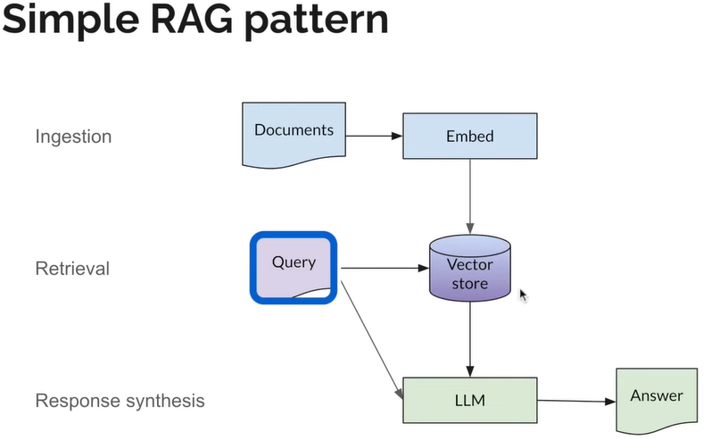

# LlamaIndex 

## Overview
- LLMs like GPT-4 come pre-trained on massive public datasets, allowing for incredible natural language processing capabilities out of the box. 
- We would like this Generative AI feature on specific/private data. To do this, We can use tools like LlamaIndex - a data framework for Large Language Models (LLMs).
- There are two mecahnism to make LLM work on private data
  - `Fine Tunning`: It is a technique where a pre-trained LLM (like BERT) is further trained on a specific dataset related to a particular task.
  - `Retrieval Augmented Generation (RAG)`: It is designed to augment LLM capabilities by retrieving relevant information from private knowledge sources before generating a response.
    - Private data is loaded.
    - Indexes are created on private data. This data can also be stored into Vector Databases.
    - User queries act on the index, which filters your data down to the most relevant context.
    - Context and your query then go to the LLM along with a prompt, and the LLM provides a response.
    
    
- LlamaIndex Platform empowers developers to spend less time managing infra & tuning parameters, and focus on AI product. 
- It is complimentary framework to Lanchain and works as below to support RAG:
  - Retrieves information from your data sources.
  - Adds it to your question as context.
  - Asks the LLM to answer based on the enriched prompt.
- LlamaIndex supports below features
  - `Data Connectors`: 
    - Ingest data from APIs, databases, PDFs, and more.
      - Sources of data often reffered as `Connectors or Readers`.
      - Content extracted from connector like pdf etc is refered as `Document`.
      - A chuck of document i.e. atomic unit of data is refered as `Node`.
  - `Data Indexes`: 
    - Organizing private data to make it easily understandble for LLM.
      - Data is stored in a numerical representation called `embeddings`. These are used between LLM and LlamaIndex.
      - Structure of data is called `vector embeddings` and stored in a database called `vector store`.
  - `Query Engines`: 
    - Aids in finding and fetching the right pieces of data, making it possible to interact with your data using natural language and ultimately create applications and workflows.
      - A `retriever` defines how to efficiently retrieve relevant context from an index when given a query.
      - A `router` determines which retriever will be used to retrieve relevant context from the knowledge base.
      - A `node postprocessor` takes in a set of retrieved nodes and applies transformations, filtering, or re-ranking logic to them.
      - A `response synthesizer` generates a response from an LLM, using a user query and a given set of retrieved text chunks.

- [Llama Hub](https://llamahub.ai/) is a library of community-driven data loaders for LLMs.

## History
- LlamaIndex was previously called GPTIndex.
- LlamaIndex was created by `Jerry Liu` after experimenting with GPT-3 and looking for ways to mitigate the limitations of the model when working with his own personal data.
- Liu open-sourced the project and publicly released it for the first time on `November 9, 2022`.
- After two months of working on the project, Liu teamed up with his former colleague at Uber, Simon Suo, to build the product and community and develop a comprehensive framework for connecting user data with LLMs.
- On June 6, 2023, Liu (CEO) and Suo (CTO) announced they had started a company around LlamaIndex and raised $8.5M in seed funding 

## Modules
- `Basics:`
  - `Features:`
     - `Semantic Search:` 
       - Finding data that matches not just your query terms, but your intent and the meaning behind your question. 
       - This is sometimes known as “top k” search.
     - `Summarization:`
       - Condensing a large amount of data into a short summary relevant to your current question.
     - `Knowledge Source:`
       - `Unstructured:` PDF, Slack etc...
       - `Structured:` SQL database, JSON etc...
       - `Multiple Sources:` Data in slack, pdf combined, best source, partial info from multiple.
  - `ServiceContext:` It is a bundle of configuration data that you pass into different parts of LlamaIndex.
- `LLM:`
  - LLMs are used at different stages of pipeline Indexing, Query - Retrieval & Query - Response Synthesis.
  - LlamaIndex provides a single interface to a large number of different LLMs.
- `Documents & Nodes:`
- `Embeddings:`
- `Retrivers:`
- `Node Postprocessors:`
- `Response Synthesizers:`
- `Indexes:`

## Tutorial
- [Youtube - Discover LlamaIndex](https://www.youtube.com/playlist?list=PLTZkGHtR085ZjK1srrSZIrkeEzQiMjO9W), [Git Repo](https://github.com/run-llama/llama_docs_bot)
- [LlamaIndex Webinars](https://www.youtube.com/playlist?list=PLTZkGHtR085YK5CdOy8vAWQ7c-mUFzTBC)

## Reference
- [Official Site](https://www.llamaindex.ai/)
- [Golden - Wiki](https://golden.com/wiki/LlamaIndex-6AYDZM9)
