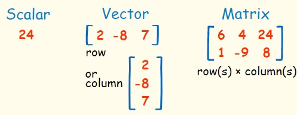

# Mathematics

## Modules
### Linear Algebra
- It is a branch of mathematics that is used to study vectors and linear functions.
  - `Scalar:` A single number.
    $$
    x \in \mathbb{R} = 5
    $$
  - `Vectors:` Represents a sequence of numbers via a single row or single column.
    $$
    \vec{v} \in \mathbb{R}^3 = \begin{bmatrix} 2 \\ 3 \\ 4 \end{bmatrix} 
    \\
    \vec{v} \in \mathbb{R}^3 = \begin{bmatrix} 2 3 4 \end{bmatrix}
    $$
  - `Matrix:` Contains a rectangular array of numbers.   
    $$
    M \in \mathbb{R}^{3 \times 2}=
    \begin{bmatrix}
    1 & 2 \\
    4 & 5 \\
    7 & 8 
    \end{bmatrix}
    $$
    
    

## Tutorial

## Reference
- [Linear Algebra](https://www.youtube.com/watch?v=fNk_zzaMoSs&list=PLZHQObOWTQDPD3MizzM2xVFitgF8hE_ab)
- [Calculus](https://www.youtube.com/watch?v=WUvTyaaNkzM&list=PLZHQObOWTQDMsr9K-rj53DwVRMYO3t5Yr)
- [Probability & Statistics](https://www.youtube.com/watch?v=COI0BUmNHT8&list=PLyqSpQzTE6M_JcleDbrVyPnE0PixKs2JE)
- [Weights & Biases - Math for Machine Learning](https://www.youtube.com/watch?v=uZeDTwWcnuY&list=PLD80i8An1OEGZ2tYimemzwC3xqkU0jKUg)
- [NPTEL - Essential Mathematics for Machine Learning](https://www.youtube.com/watch?v=JO9jNe6BemE&list=PLLy_2iUCG87D1CXFxE-SxCFZUiJzQ3IvE)
- [Udemy Course](https://www.udemy.com/course/mathematics-basics-to-advanced-for-data-science-and-ml/)
- [Markdown LaTex](https://ashki23.github.io/markdown-latex.html#latex)