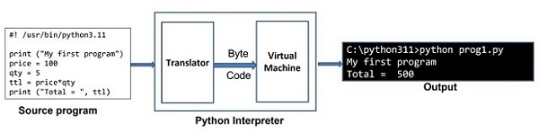

# Python

## Overview
- Python is a high-level, interpreted, interactive, dynamically typed, functional & object-oriented programming language.
- Python is an open-source and cross-platform programming language.
- Python is commonly used for developing websites and software, task automation, data analysis, data visualisation and Machine learning.

## History
- Python was developed by Guido van Rossum in the late eighties and early nineties at the National Research Institute for Mathematics and Computer Science in the Netherlands.
- Language was named after a popular comedy series `Monty Python's Flying Circus` on BBC.
- There are two major release of Python `2.x.x` & `3.x.x`. Python 3.0, a completely revamped version of Python was released in December 2008. It was revamped to remove a lot of discrepancies that had crept in Python 2.x versions.

## Moduels
- **Basics:**
  - **Interpreter:**
    - Python is an interpreter-based language.
    - Python code is executed by one statement at a time. It has two parts
      - `Translator:` Checks the statement for syntax.
      - `Virtual machine:` Converts the byte code in native binary and executes it. 
        
- **Comments:**
  - `Single-line:`
    ```python
    # This is a single-line comment
    ```
  - `Multi-line:`
    ```python
    """
    This is a multi-line comment.
    It spans multiple lines.
    """
    ```
  - `Doc-string:`
    ```python
    def multiply_numbers(a, b):
    """
    Multiplies two numbers and returns the result.
 
    Args:
        a (int): The first number.
        b (int): The second number.
 
    Returns:
        int: The product of a and b.
    """
    return a * b
    print(multiply_numbers(3,5))
    ```
- **Varaiables:**
  - Python has no command for declaring a variable.
  - A variable is created the moment you first assign a value to it.
  - Variable names are case-sensitive.
  - String variables can be declared either by using single or double quotes.
  - **DataTypes:**
    - **Primitive:**
      - Integers
      - Floats
      - Strings
      - Booleans, True/False
    - **Derived:**
      - List
        - List items are `ordered, changeable, and allow duplicate` values.
        - A list can contain different data types.
        - List items are indexed, the first item has index [0], the second item has index [1]
        - Negative indexing means start from the end. -1 refers to the last item, -2 refers to the second last item etc.
          ```python
          furitList = ["apple", "banana", "cherry"]
          ```
      - Tuple
        - Tuple items are `ordered, unchangeable, and allow duplicate` values.
        - Tuple items can be of any data type.
        - Indexing works similar to List.
          ```python
          furitTuple = ("apple", "banana", "cherry")
          ```
      - Set
        - A set is a collection which is `unordered, unchangeable, and unindexed`.
          ```python
          furitSet = {"apple", "banana", "cherry"}
          ```
      - Dictionary
        - Dictionaries are used to store data values in `key:value` pairs.
          ```python
          vehicleDict = {
                      "brand": "Ford",
                      "model": "Mustang",
                      "year": 1964
                    }
          print(vehicleDict)
          ```
    - **TypeCasting:**
      - int()
      - float()
      - str()
      - bool()
        - Any string is True, except empty strings.
        - Any number is True, except 0.
        - Any list, tuple, set, and dictionary are True, except empty ones.
  - **Scope:**
    - 
- **Operators:**
  - **Arithmetic:**
  - **Comparison:**
- **Statements:**
  - **If:**
  - **While:**
  - **For:**
- **Functions:**
  - **Lamda:**
- **Expectional Handling:**
- **Threading:**
- **Unit Testing:**
- **Object Oriented Programming:**
- **Functional Programming:**
- **Library:**
  - **Creating Library:**
  - **System Defined Functions:**

## Reference
- [Harvard CS50’s Introduction to Programming with Python](https://www.youtube.com/watch?v=nLRL_NcnK-4&t=2365s)
- [Stanford - Python](https://www.youtube.com/watch?v=Oe6rHPmFY3o&list=PLVxFQjPUB2cnYGZPAGG52OQc9SpWVKjjB)
- [Harvard CS50’s - Artificial Intelligence with Python](https://www.youtube.com/watch?v=5NgNicANyqM&t=11421s)
- [Git balban - Books](https://github.com/balban/Books/tree/master)