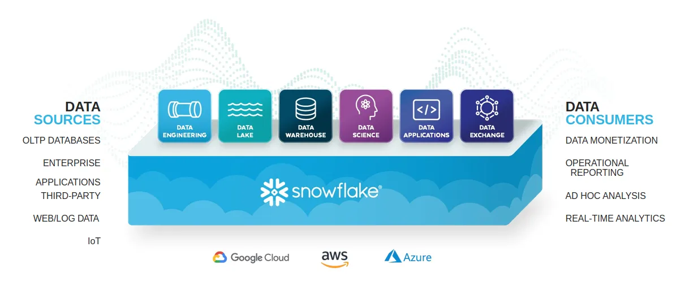

# Snowflake

## Overview
- Snowflake is a fully managed SaaS (software as a service) that provides a single platform for data warehousing, data lakes, data engineering, data science, data application development, and secure sharing and consumption of real-time / shared data.
  
- It is a three layer based architecture that can be deployed on AWS, GCP & Azure.
  - `Compute (Virtual Warehouse) Layer:`​
    - Snowflake processes queries using `virtual warehouses`.
    - Each virtual warehouse is an MPP compute cluster composed of multiple compute nodes allocated by Snowflake from a cloud provider.
  - `Storage Layer​:`
    - Hybrid Columnar, Automatic micro-partitioning, Physical data files that comprise Snowflake’s logical tables.
  - `Cloud Services Layer:`
    - Manages and coordinates activities across Snowflake.

## History
- Snowflake Inc. was founded in July 2012 in San Mateo, California by three data warehousing experts: Benoît Dageville, Thierry Cruanes and Marcin Żukowski.
- In June 2014, the company appointed former Microsoft executive Bob Muglia as CEO. He was here until April 2019.
- In May 2019, Frank Slootman, the retired former CEO of ServiceNow, joined Snowflake as its CEO and Michael Scarpelli, the former CFO of ServiceNow joined the company as CFO.
- In June 2019, the company launched `Snowflake Data Exchange`.
- On September 16, 2020, Snowflake became a public company via IPO raising $3.4 billion.
- On March 2, 2022, the company acquired Streamlit for $800 million.

## Modules
- `App Overview:`
  - `Worksheet:` It is an interface for submitting SQL queries, performing DDL and DML operations, and viewing results as your queries or operations complete.
  - `Dashboard:` 
    - It allows you to create flexible displays of one or more charts.
    - Tiles and widgets are produced by executing SQL queries that return results in a worksheet.
  - `Data:`
    - `Databases:` 
      - User can create, clone, drop, or transfer ownership of databases, as well as load data in the UI
    - `Private Shared Data:`
      - Share Snowflake tables among separate Snowflake accounts or external users, without having to create a copy of the data.
  - `Marketplace:`
    - Any Snowflake customer can browse and consume data sets made available by providers.
      - `Public:`
        - Data is free data sets available for querying instantaneously.
      - `Personalized:`
        - Data requires reaching out to the provider of data for approval of sharing data.
  - `Activity:`
    - `Query Histor:`
      - View the details of all queries executed in the last 14 days from your Snowflake account.
      - Click a query ID to drill into it for more information.
    - `Copy History:`
      - Shows the status of copy commands run to ingest data into Snowflake.
  - `Admin:`
    - `Warehouses:`
      - Set up and manage compute resources known as virtual warehouses to load or query data in Snowflake.
      - By default `COMPUTE_WH` already exists in your environment.
    - `Resource Monitors:`
      - Lists all resource monitors created to control the number of credits that virtual warehouses consume.
      - For each resource monitor, it shows the credit quota, type of monitoring, schedule, and actions performed when the virtual warehouse reaches its credit limit.
    - `Users and Roles:`
      - `Roles:`
        - Shows list of the roles and their hierarchies.
        - Roles can be created, reorganized, and granted to users in this tab.
      - `Users:`
        - List users in the account, default roles, and owner of the users.
        - Permissions granted through your current role determine the information shown for this tab.
        - To see all the information available on the tab, switch your role to `ACCOUNTADMIN`.
        - Default role is `SYSADMIN`. It has privileges to create warehouses, databases, and other objects in an account.

## Tutorial
- [Entry Level Guide](https://quickstarts.snowflake.com/guide/getting_started_with_snowflake/index.html#0)

## Refernce
- 