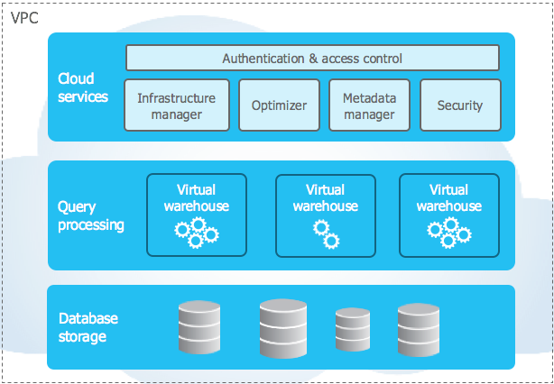

# Snowflake

## Overview
- Snowflake is a fully managed SaaS (software as a service) that provides a single platform for data warehousing, data lakes, data engineering, data science, data application development, and secure sharing and consumption of real-time / shared data.
  
- Snowflake combines a completely new SQL query engine - `SnowSQL` with an innovative architecture natively designed for the cloud.

## Architecture
- Its architecture is a hybrid of traditional shared-disk and shared-nothing database architectures.
- Like shared-disk architectures, It uses a central data repository for persisted data that is `accessible from all compute nodes` in the platform.
- Like shared-nothing architectures, It processes queries using `MPP (massively parallel processing)` compute clusters where each node in the cluster `stores a portion of the entire data set locally`.
- This approach offers the data management simplicity of a shared-disk architecture, but with the performance and scale-out benefits of a shared-nothing architecture.
- Snowflake architecture is based on three layers
  - `Database Storage:`
    - Snowflake re-organizes the loaded data into its internal optimized, compressed, columnar format.
    - It manages all aspects of how this data is stored — the organization, file size, structure, compression, metadata, statistics, and other aspects.
    - The data objects stored by Snowflake are not directly visible nor accessible by customers; they are only accessible through SQL query operations.
  - `Query Processing:`
    - It processes queries using `virtual warehouses`.
    - Each virtual warehouse is an `MPP compute cluster` composed of multiple compute nodes allocated by Snowflake from a cloud provider.
    - Each virtual warehouse is an independent compute cluster that does not share compute resources with other virtual warehouses.
  - `Cloud Services:`
    - The cloud services layer is a collection of services that coordinate activities across Snowflake.
    - It also runs on compute instances provisioned by Snowflake from the cloud provider.

  

## History
- Snowflake Inc. was founded in July 2012 in San Mateo, California by three data warehousing experts: Benoît Dageville, Thierry Cruanes and Marcin Żukowski.
- In June 2014, the company appointed former Microsoft executive Bob Muglia as CEO. He was here until April 2019.
- In May 2019, Frank Slootman, the retired former CEO of ServiceNow, joined Snowflake as its CEO and Michael Scarpelli, the former CFO of ServiceNow joined the company as CFO.
- In June 2019, the company launched `Snowflake Data Exchange`.
- On September 16, 2020, Snowflake became a public company via IPO raising $3.4 billion.
- On March 2, 2022, the company acquired Streamlit for $800 million.

## Modules
- `App Overview:`
  - `Worksheet:` It is an interface for submitting SQL queries, performing DDL and DML operations, and viewing results as your queries or operations complete.
  - `Dashboard:` 
    - It allows you to create flexible displays of one or more charts.
    - Tiles and widgets are produced by executing SQL queries that return results in a worksheet.
  - `Data:`
    - `Databases:` 
      - User can create, clone, drop, or transfer ownership of databases, as well as load data in the UI
    - `Private Shared Data:`
      - Share Snowflake tables among separate Snowflake accounts or external users, without having to create a copy of the data.
  - `Marketplace:`
    - Any Snowflake customer can browse and consume data sets made available by providers.
      - `Public:`
        - Data is free data sets available for querying instantaneously.
      - `Personalized:`
        - Data requires reaching out to the provider of data for approval of sharing data.
  - `Activity:`
    - `Query Histor:`
      - View the details of all queries executed in the last 14 days from your Snowflake account.
      - Click a query ID to drill into it for more information.
    - `Copy History:`
      - Shows the status of copy commands run to ingest data into Snowflake.
  - `Admin:`
    - `Warehouses:`
      - Set up and manage compute resources known as virtual warehouses to load or query data in Snowflake.
      - By default `COMPUTE_WH` already exists in your environment.
    - `Resource Monitors:`
      - Lists all resource monitors created to control the number of credits that virtual warehouses consume.
      - For each resource monitor, it shows the credit quota, type of monitoring, schedule, and actions performed when the virtual warehouse reaches its credit limit.
    - `Users and Roles:`
      - `Roles:`
        - Shows list of the roles and their hierarchies.
        - Roles can be created, reorganized, and granted to users in this tab.
      - `Users:`
        - List users in the account, default roles, and owner of the users.
        - Permissions granted through your current role determine the information shown for this tab.
        - To see all the information available on the tab, switch your role to `ACCOUNTADMIN`.
        - Default role is `SYSADMIN`. It has privileges to create warehouses, databases, and other objects in an account.

## Tutorial
- [Entry Level Guide](https://quickstarts.snowflake.com/guide/getting_started_with_snowflake/index.html#0)
- [Hands on Labs](https://www.snowflake.com/virtual-hands-on-lab/)
- [Documentation](https://docs.snowflake.com/)
- [Courses](https://learn.snowflake.com/en/courses/)
- [Snowflake Tutorial for Beginners](https://www.youtube.com/watch?v=AR88dZG-hwo&list=PLba2xJ7yxHB7SWc4Sm-Sp3uGN74ulI4pS)

## Reference
- [Apache Iceberg or Snowflake Table format](https://medium.com/snowflake/apache-iceberg-or-snowflake-table-format-299eb9fb7b0c)
- [Deep dive - Virtual Warehouse](https://medium.com/snowflake/deep-dive-into-the-internals-of-snowflake-virtual-warehouses-d6d9676127d2)
- [Snowflake: The Good, The Bad and The Ugly](https://0x0fff.com/snowflake-the-good-the-bad-and-the-ugly/)
- [The Snowflake Elastic Data Warehouse - Published:14 June 2016](https://dl.acm.org/doi/pdf/10.1145/2882903.2903741)
- [Lakehouse](https://www.cidrdb.org/cidr2021/papers/cidr2021_paper17.pdf)